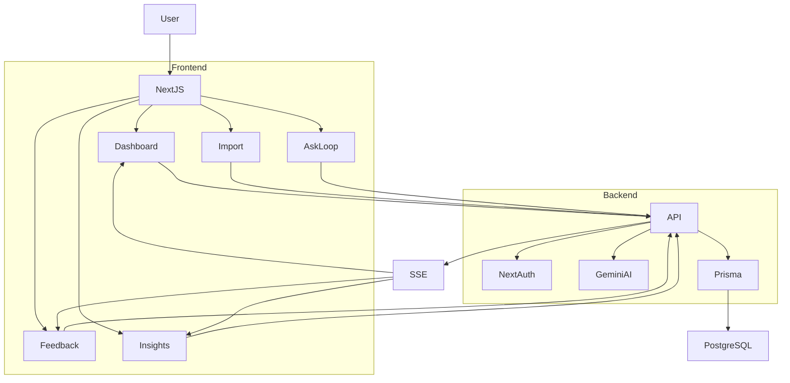

# Project LOOP

## AI-Powered Customer Feedback Intelligence Platform

Project LOOP is an AI-powered Voice of Customer (VoC) platform developed during the **Zidio Development Internship**.

The application enables organizations to collect customer feedback, classify customer sentiment using Artificial Intelligence, identify business themes, monitor customer experience through interactive dashboards, and generate actionable business insights.

Unlike traditional feedback systems, Project LOOP transforms raw customer feedback into structured business intelligence using Google Gemini AI.

---

# Live Demo


```
Vercel Deployment: https://ai-feedback-loop-beige.vercel.app
```

---

# Features

## Authentication

- User Signup
- User Login
- Session Management using NextAuth
- Protected Dashboard

---

## Dashboard

Interactive dashboard displaying:

- Total Feedback
- Positive Feedback
- Negative Feedback
- Neutral Feedback
- Pending Feedback
- Sentiment Distribution
- Theme Distribution
- Theme Trends
- AI Summary
- Voice of Customer Insights

---

## Feedback Management

- View all feedback
- Search feedback
- Filter by sentiment
- Delete feedback
- Real-time updates
- Live synchronization using Server Sent Events (SSE)

---

## CSV Import

Bulk upload customer feedback using CSV.

Features include:

- Drag and Drop Upload
- CSV Validation
- Duplicate Detection
- Import Summary
- Failed Row Export
- Preview Before Import

---

## Demo Data Generator

Generate realistic customer feedback for testing.

Automatically generates:

- Customer Reviews
- Themes
- Sentiments
- Channels
- Random Dates

---

## AI Features

### AI Summary

Generates a concise business summary using Google Gemini AI.

---

### Automatic Classification

Automatically classifies feedback into

- Positive
- Negative
- Neutral

and assigns AI-generated themes.

---

### Theme Detection

Automatically identifies business topics such as

- Authentication
- Performance
- Dashboard
- User Interface
- Notifications
- Search
- Payments
- Support

---

### Theme Trend Analysis

Visualizes theme growth over time.

---

### Voice of Customer Report

Automatically generates

- Executive Summary
- Customer Pain Points
- Positive Highlights
- Business Recommendations

---

### Ask LOOP

AI assistant capable of answering questions such as

- What are customers complaining about?
- Which feature receives the most praise?
- What themes are increasing this month?

---

### Spike Detection

Detects sudden increases in customer complaints.

---

# System Architecture



---

# Application Workflow

```
Customer Feedback
        │
        ▼
CSV Upload / Manual Entry
        │
        ▼
Validation Layer
        │
        ▼
PostgreSQL Database
        │
        ▼
Google Gemini AI
        │
        ▼
Sentiment Classification
Theme Detection
        │
        ▼
Dashboard Analytics
        │
        ▼
Voice of Customer Report
        │
        ▼
Business Insights
        │
        ▼
Live Dashboard Updates
```

---

# Technology Stack

## Frontend

- Next.js 15
- React
- TypeScript
- Tailwind CSS
- Recharts
- Chart.js

## Backend

- Next.js API Routes

## Database

- PostgreSQL
- Prisma ORM

## Authentication

- NextAuth

## Artificial Intelligence

- Google Gemini API

## Deployment

- Vercel

---

# Folder Structure

```
app
│
├── api
│   ├── ai-summary
│   ├── analyze
│   ├── ask-loop
│   ├── auth
│   ├── dashboard
│   ├── export
│   ├── feedback
│   ├── import
│   ├── insights
│   ├── live
│   ├── reclassify
│   ├── seed-feedback
│   ├── signup
│   ├── spikes
│   ├── theme-trends
│   └── voc-report
│
├── dashboard
│   ├── feedback
│   ├── import
│   ├── insights
│   ├── seed
│   └── test
│
├── login
│
├── globals.css
├── layout.tsx
├── page.tsx
└── providers.tsx

lib
├── ai.ts
├── auth.ts
├── events.ts
├── live.ts
└── prisma.ts

prisma
└── schema.prisma
```

---

# Database Schema

## User

| Field | Type |
|--------|------|
| id | String |
| name | String |
| email | String |
| password | String |
| role | String |

---

## Feedback

| Field | Type |
|--------|------|
| id | String |
| content | String |
| channel | String |
| sentiment | String |
| theme | String |
| createdAt | DateTime |

---

# API Endpoints

| Endpoint | Description |
|------------|-------------------------------|
| /api/signup | User Registration |
| /api/auth | User Authentication |
| /api/dashboard | Dashboard Statistics |
| /api/feedback | Feedback CRUD |
| /api/import | CSV Import |
| /api/export | Export CSV |
| /api/seed-feedback | Generate Demo Feedback |
| /api/analyze | AI Classification |
| /api/ai-summary | AI Business Summary |
| /api/reclassify | Reclassify Feedback |
| /api/theme-trends | Theme Analytics |
| /api/spikes | Spike Detection |
| /api/voc-report | Voice of Customer Report |
| /api/ask-loop | AI Chat Assistant |
| /api/live | Live Updates (SSE) |
| /api/insights | Dashboard Insights |

---

# Installation

Clone the repository

```bash
git clone https://github.com/Srikanthnaidu13/project-loop.git
```

Navigate into the project

```bash
cd project-loop
```

Install dependencies

```bash
npm install
```

Generate Prisma Client

```bash
npx prisma generate
```

Run database migrations

```bash
npx prisma migrate dev
```

Start the development server

```bash
npm run dev
```

---

# Environment Variables

Create a `.env` file in the root directory.

```env
DATABASE_URL=your_postgresql_database_url

NEXTAUTH_URL=http://localhost:3000

NEXTAUTH_SECRET=your_nextauth_secret

GEMINI_API_KEY=your_gemini_api_key
```

**Important**

Never commit your `.env` file or API keys to GitHub.

---

# Screenshots

Include screenshots for:

- Landing Page
- Login
- Dashboard
- Feedback Management
- CSV Import
- Insights
- AI Summary
- Theme Trends
- Voice of Customer Report
- Ask LOOP

---

# Future Enhancements

- Workspace Management
- Role-Based Access Control
- Slack Integration
- Gmail Integration
- Twitter Integration
- Play Store Integration
- PDF Report Generation
- Excel Export
- Email Notifications
- AI Recommendation Engine
- Advanced Analytics

---

# Author

**Srikanth S**

Bachelor of Technology – Information Technology

GitHub

https://github.com/Srikanthnaidu13

LinkedIn

https://linkedin.com/in/srikanths13

Portfolio

https://srikanthsdev.vercel.app

---

# License

This project was developed as part of the **Zidio Development Internship**.

This repository is intended for educational and portfolio purposes.